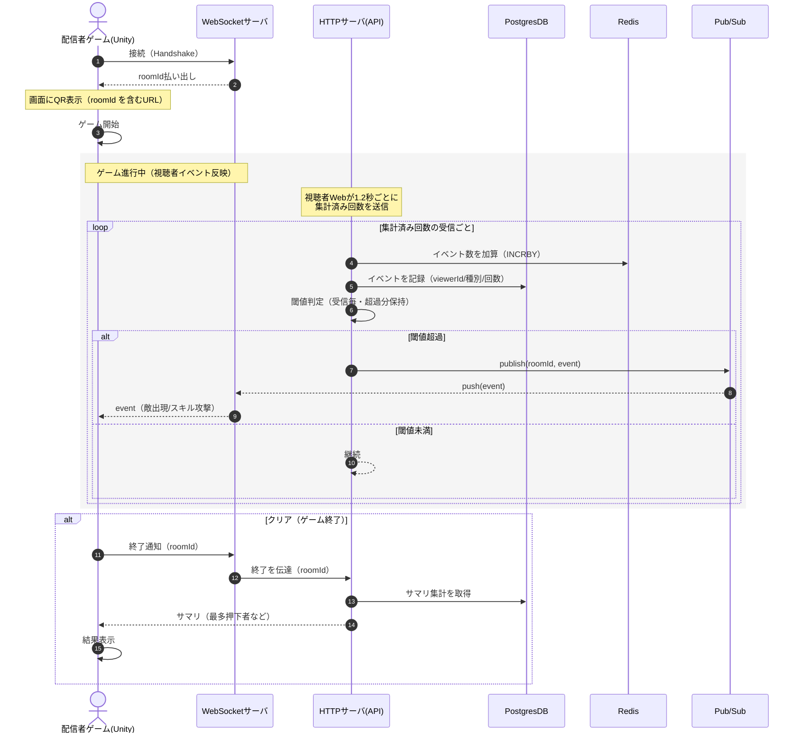
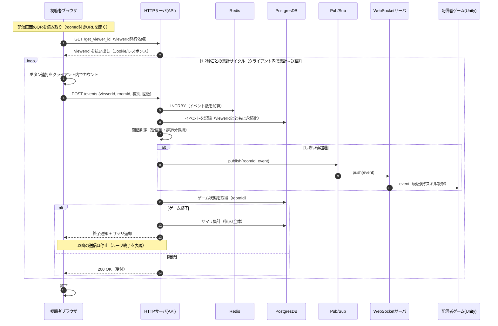

# 処理フロー（配信者サイド / 視聴者側）

本ドキュメントは、配信者サイドと視聴者側の処理の流れを、Mermaid のシーケンス図で示します。実装は `AGENTS.md` と `docs/game_end_plan.md` の方針に沿い、高凝集・低結合を意識した役割分離（REST/API と WebSocket、DB、Redis、Pub/Sub）を前提としています。

---

## 配信者サイド

---

## 視聴者側

---

### 説明と前提
- 配信者ゲーム（Unity）は WebSocket サーバへ接続して `roomId` を取得し、その `roomId` を含むURLのQRを表示します。
- 視聴者は QR から Web サイトへ遷移し、`/get_viewer_id` で `viewerId` を払い出し。以降は 1.2 秒ごとに連打数を API に送信します。
- API は Redis にイベント数を蓄積し、しきい値超過時に Pub/Sub を通じて WS サーバへ通知。WS サーバは Unity へイベントを送出します。
- イベントは PostgresDB にも永続化され、終了時には API が DB からサマリを集計して配信者（Unity）と視聴者へ返します。
- 実装上は REST(API) と WebSocket サーバを別プロセス（別デプロイ）に分離可能とし、負荷に応じたスケールを容易にしています。

